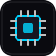

# SENSECORE — Real-Time Embedded Computer Architecture Simulator

A live, interactive Computer Organization & Architecture (COA) simulator with frosted glass aesthetics, realistic physical transducer physics, CPU instruction pipelines, ALU workbenches, and system bus visualizations.



---

## 🏛️ System Architecture Overview

SENSECORE models a complete 8-bit Harvard microcontroller architecture with unified telemetry and peripheral buses:

- **Transducer Subsystem**: 6 physical sensors (Temperature, Humidity, Barometer, Ambient Light, Air Quality, Ultrasonic Proximity) updating via smoothed random-walk noise.
- **CPU Core**: 4-stage sequential instruction execution pipeline (`FETCH` $\to$ `DECODE` $\to$ `EXECUTE` $\to$ `STORE`) with opcode decoding and side-effect dispatching.
- **8-Bit ALU**: Supports `ADD`, `SUBTRACT`, `AND`, `OR`, `XOR`, `NOT`, and `COMPARE` with real-time condition flag evaluation ($Z$, $N$, $C$, $V$).
- **Register File**: $R_0$–$R_7$, Program Counter ($PC$), Stack Pointer ($SP$), and Condition Flags ($FLAGS$).
- **Static RAM (SRAM)**: 64-Byte memory array with animated `READ` (emerald) and `WRITE` (amber) pulse cycles.
- **System Buses**: Three dedicated interconnect buses (**ADDRESS BUS**, **DATA BUS**, **CONTROL BUS**) with live moving data telemetry indicators.
- **Real-Time Instrumentation**: 60-point rolling Canvas charts and terminal execution telemetry.

---

## 🚀 Quick Start

### Prerequisites
- Node.js (v16+) or any web browser.

### Running Locally

1. **Clone the repository:**
   ```bash
   git clone https://github.com/Naresh-its/COA-PROJECT-SENSECORE.git
   cd COA-PROJECT-SENSECORE
   ```

2. **Start the local server:**
   ```bash
   node server.js
   ```

3. **Open in browser:**
   Navigate to [http://localhost:3000/](http://localhost:3000/)

---

## 🧪 Automated Subsystem Tests

Run the built-in 33-step automated test suite:

```bash
node test_simulator.js
```

---

## 📂 Project Structure

```
COA-PROJECT-SENSECORE/
├── index.html              # Main application shell & view templates
├── server.js               # Zero-dependency local static HTTP server
├── test_simulator.js       # Automated subsystem verification suite
├── favicon.svg             # Microchip vector icon
├── css/
│   ├── variables.css       # Design tokens & color variables
│   ├── base.css            # Typography & reset
│   ├── glass.css           # Glassmorphism panels & backdrop filters
│   ├── layout.css          # Topbar & sidebar grid layout
│   ├── animations.css      # Keyframes, glow effects & pulse states
│   ├── components.css      # Buttons, badges & cards
│   └── pages.css           # Page-specific styling for all 8 views
└── js/
    ├── app.js              # Central application controller & router
    ├── simulation.js       # Master clock loop & state machine
    ├── sensors.js          # Transducer physics & threshold alerts
    ├── cpu.js              # 4-stage CPU pipeline & instruction stepper
    ├── alu.js              # 8-bit arithmetic & logic engine
    ├── registers.js        # Internal fast register array
    ├── memory.js           # 64-Byte static RAM model
    ├── dataflow.js         # Serpentine packet animation engine
    ├── bus.js              # Address/Data/Control bus visualizer
    ├── charts.js           # Lightweight real-time canvas chart engine
    ├── logger.js           # Terminal execution telemetry stream
    └── utils.js            # Interpolation, formatting & event emitter
```

---

## 📄 License

MIT License. Designed for Computer Organization and Architecture (COA) educational labs and real-time embedded system simulations.
